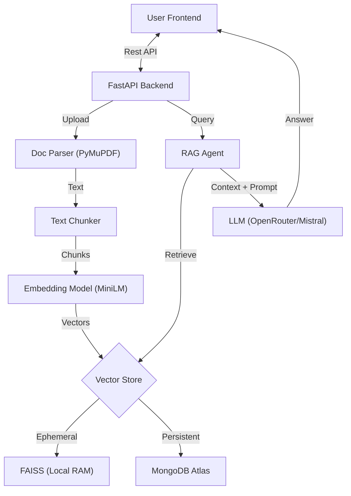

# 🤖 AI-Powered PDF & Google Drive Q&A Chatbot


A powerful, modern RAG (Retrieval-Augmented Generation) application that allows users to chat with their **local PDF documents** and **Google Drive archives** seamlessly. Built with a focus on privacy, speed, and clean UI/UX.

---

## 🌟 Key Features

* **📄 Local PDF Analysis**: Instantly upload and chat with PDF, DOCX, XLSX, and limited PPTX files securely.
* **☁️ Google Drive Integration**: Syncs with a designated Google Drive folder to create a searchable knowledge base.
* **🧠 Custom RAG Engine**:
  * **Parsing**: High-fidelity text extraction using `PyMuPDF` (fitz).
  * **Chunking**: Recursive character splitting for semantic context preservation.
  * **Embeddings**: `all-MiniLM-L6-v2` (Local Sentence Transformers) - No API costs for embedding!
  * **Vector Store**: Dual-store architecture:
    * **Local**: In-memory FAISS for temporary session uploads.
    * **Drive**: MongoDB Atlas Vector Search for persistent cloud knowledge.
* **🗣️ Voice Interaction**: Integrated Text-to-Speech (TTS) and Speech-to-Text (STT) for a hands-free experience.
* **🎨 Premium UI**: Glassmorphism design system using React + TailwindCSS + Framer Motion.

---

## 🏗️ Architecture

This project uses a **Hybrid RAG** approach to handle both ephemeral local files and persistent cloud data.



---

## 🛠️ Tech Stack

### Backend

* **Framework**: FastAPI (High-performance Async I/O)
* **Language**: Python 3.x
* **AI/ML Logic**:
  * `sentence-transformers` (Embeddings)
  * `pymupdf` (PDF Parsing)
  * `faiss-cpu` (Vector Search)
  * `pymongo` (Database Connectivity)
* **LLM Provider**: OpenRouter (Mistral AI models)

### Frontend

* **Library**: React (Vite)
* **Styling**: TailwindCSS
* **Animations**: Framer Motion
* **Icons**: Lucide React
* **HTTP Client**: Axios

---

## 🚀 Getting Started

### Prerequisites

* Node.js & npm
* Python 3.10+
* MongoDB Atlas Account
* Google Cloud Service Account (for Drive)
* OpenRouter API Key

### Installation

1. **Clone the repository**

   ```bash
   git clone https://github.com/DurgaPydahSoft/PDF-QA-CHATBOT
   ```
2. **Backend Setup**

   ```bash
   cd backend
   pip install -r requirements.txt

   # Configure .env
   # Add OPENROUTER_API_KEY, MONGODB_URI, Google Credentials

   python run.py
   ```
3. **Frontend Setup**

   ```bash
   cd frontend
   npm install
   npm run dev
   ```

---

---

## ☁️ Deployment

### Hugging Face Spaces (Docker)

The backend is optimized for deployment on Hugging Face Spaces using Docker.

1. **Create a Space**: Select "Docker" as the SDK.
2. **Environment Variables**: Go to "Settings" and add the variables from `.env`.
   * *Note*: Credentials can be pasted directly; the app automatically cleans quoted values.
3. **CI/CD Pipeline**:
   * This project includes a **GitHub Action** workflow.
   * Every push to `main` triggers a build and pushes the Docker image to Hugging Face automatically.

### Google Drive Setup

For Google Drive sync functionality, see the comprehensive setup guide:

📖 **[Google Drive Setup Guide](docs/GOOGLE_DRIVE_SETUP.md)**

**Quick Setup:**
- **Local Development**: Place `service_account.json` in `backend/` directory
- **Production**: Base64-encode the JSON and add as `GOOGLE_SA_KEY_BASE64` secret in Hugging Face Spaces

Use the helper script to encode your service account:
```bash
python backend/scripts/encode_service_account.py
```

---

* Google Credentials are sanitized and can be loaded safely from Environment Variables (ideal for Hugging Face/Render hosting).
* Local uploads are processed in-memory and not stored permanently.

---

## 🤝 Contributing

Contributions are welcome! Please fork the repo and submit a PR.
